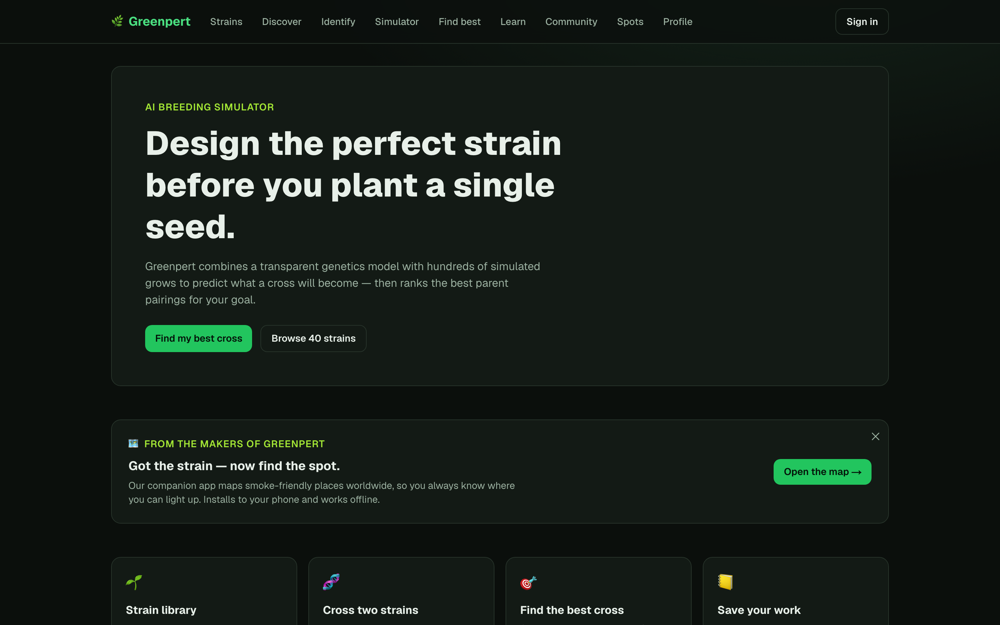
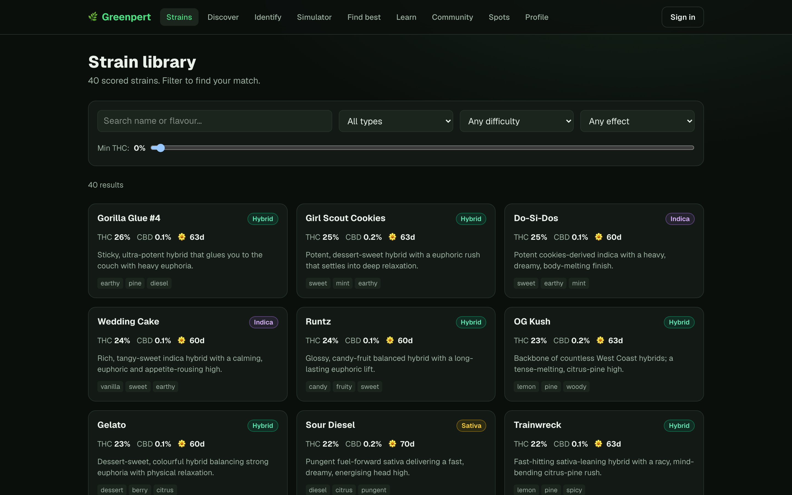
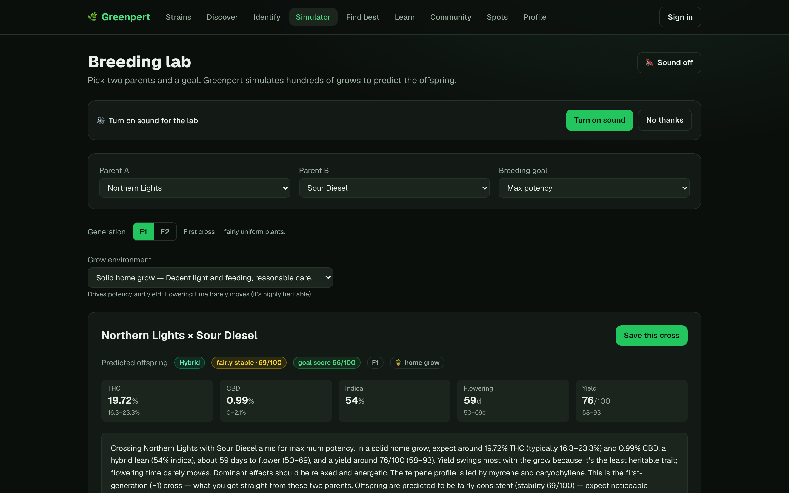
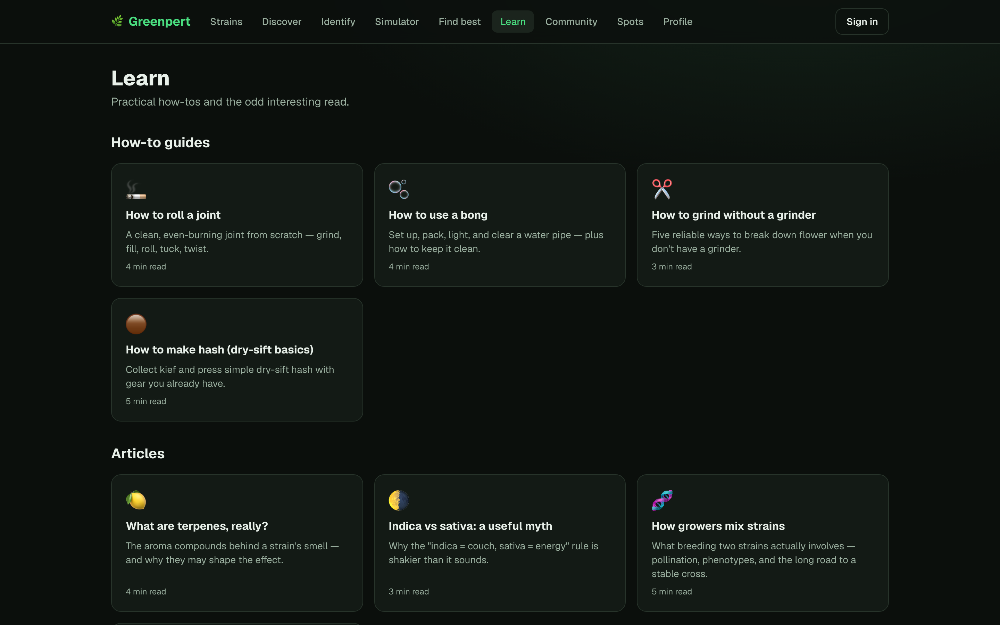
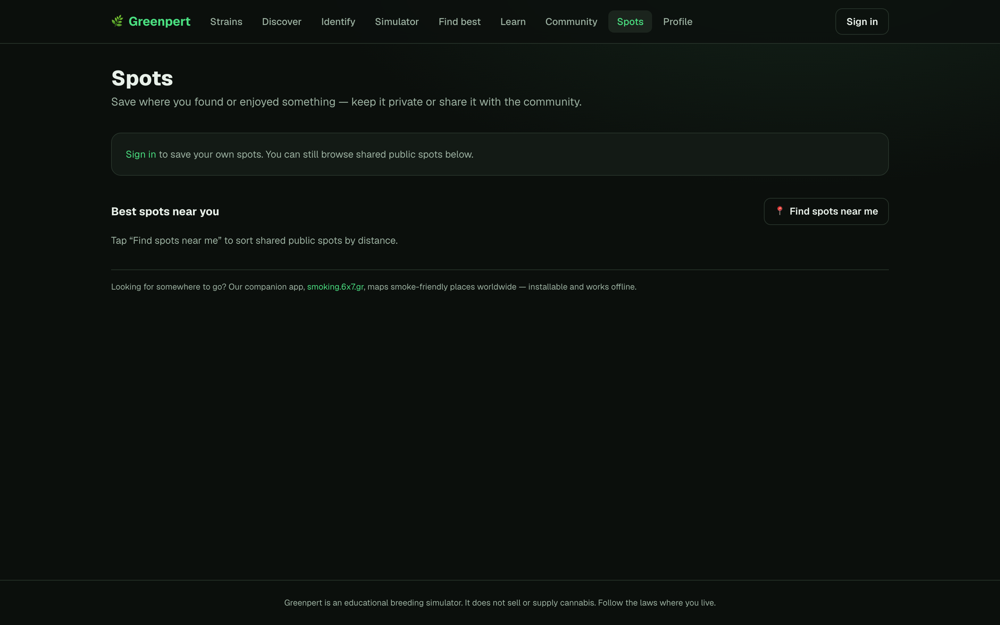

# App Screenshot Gallery

Click any screenshot to open the full-size image.

<table>
  <tr>
    <td align="center" valign="top"><a href="shots/greenpert-home.png"></a><br><sub><b>Greenpert Home</b> — <a href="http://greenpert.6x7.gr">http://greenpert.6x7.gr</a></sub></td>
    <td align="center" valign="top"><a href="shots/greenpert-strains.png"></a><br><sub><b>Greenpert Strains</b> — <a href="http://greenpert.6x7.gr/strains">http://greenpert.6x7.gr/strains</a></sub></td>
    <td align="center" valign="top"><a href="shots/greenpert-simulator.png"></a><br><sub><b>Greenpert Simulator</b> — <a href="http://greenpert.6x7.gr/simulator">http://greenpert.6x7.gr/simulator</a></sub></td>
  </tr>
  <tr>
    <td align="center" valign="top"><a href="shots/greenpert-learn.png"></a><br><sub><b>Greenpert Learn</b> — <a href="http://greenpert.6x7.gr/learn">http://greenpert.6x7.gr/learn</a></sub></td>
    <td align="center" valign="top"><a href="shots/greenpert-spots.png"></a><br><sub><b>Greenpert Spots</b> — <a href="http://greenpert.6x7.gr/spots">http://greenpert.6x7.gr/spots</a></sub></td>
  </tr>
</table>

---

## How this works (reusable tool)

Screenshots multiple pages of a web app and builds the clickable grid above. No API keys, no cost — pure headless browser.

```bash
npm install
npx playwright install chromium   # one-time browser download
npm run build                      # screenshot every page + rebuild this README
```

- Edit [`apps.json`](apps.json) to list the pages you want: `{ "name": "...", "url": "https://..." }`
- Add a `"dismiss"` array to click through age-gates or cookie banners before snapping
- `npm run shots` — re-screenshot only
- `npm run grid` — rebuild README from existing shots (`COLS=4` to force column count)
- Grid columns auto-scale: 1–2 shots → match count, 3–4 → 2 cols, 5–9 → 3 cols, 10–16 → 4 cols, 17+ → 5 cols

Screenshots live in [`shots/`](shots/) at 1440×900, retina (2×).
