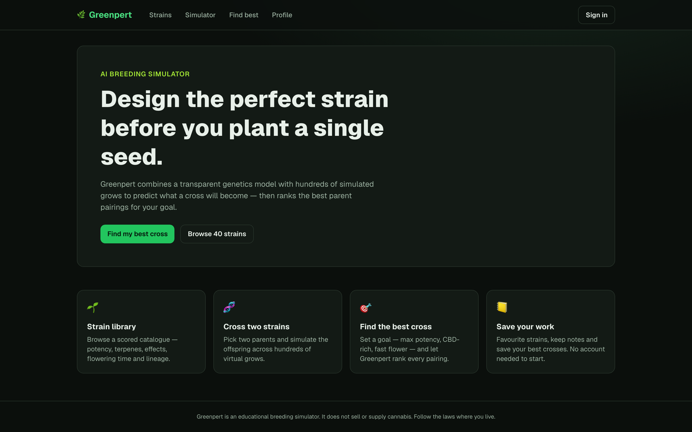

# App Screenshot Gallery

Click any screenshot to open the full-size image.

<table>
  <tr>
    <td align="center" valign="top"><a href="shots/greenpert.png"></a><br><sub><b>GreenPert</b> — <a href="http://greenpert.6x7.gr">http://greenpert.6x7.gr</a></sub></td>
  </tr>
</table>

---

## How this works (reusable tool)

This repo screenshots a list of web apps and builds the grid above. No API keys, no cost.

```bash
npm install
npx playwright install chromium   # one-time browser download
npm run build                      # screenshot every app + rebuild this README
```

- Add apps in [`apps.json`](apps.json): `{ "name": "...", "url": "https://..." }`
- `npm run shots` — screenshot only (`node capture.mjs greenpert` for one app)
- `npm run grid` — rebuild README from existing screenshots (`COLS=4` to change columns)

Screenshots live in [`shots/`](shots/) at 1440×900, retina (2x).
